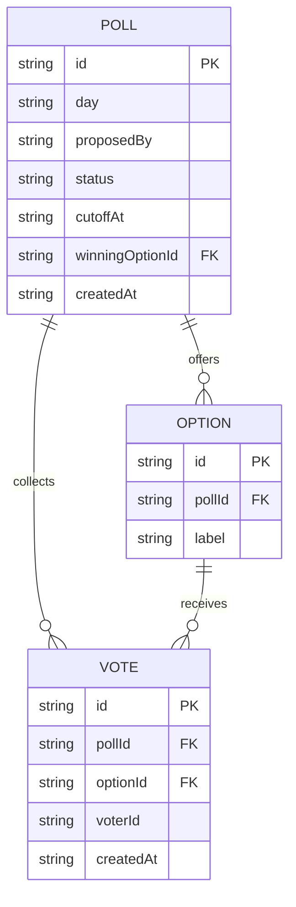

# Domain model

The product revolves around one poll open at a time: a teammate proposes it
with a handful of lunch options, every other teammate votes once, and the
poll resolves to a winning option once it closes.

- A `POLL` holds between 2 and 5 `OPTION`s, fixed at creation. `status` is
`open` or `closed`. `winningOptionId` is set once the poll closes, and left
unset when no votes were cast.
- A `VOTE` links one `voterId` to one `OPTION` of one `POLL`; a voter has at
most one vote per poll, and a vote's `optionId` never changes once cast.
`voterId` is never exposed back to other teammates — it exists only to
enforce one vote each.