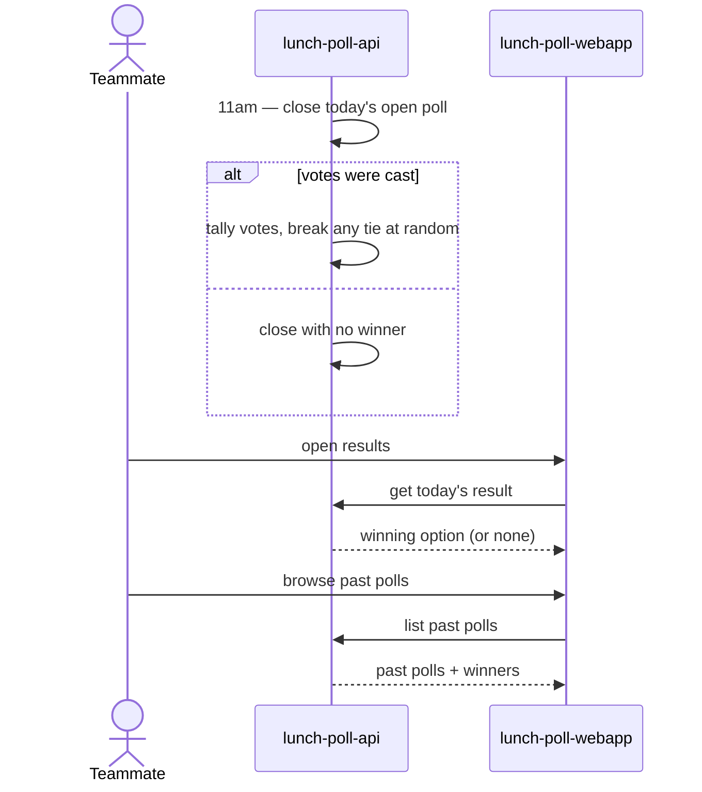

# Voting closes, and a teammate sees the result

At 11am the open poll closes automatically; afterwards any teammate sees the
winning option, and can look back at past polls.

```mermaid
sequenceDiagram
    actor Teammate
    participant api as lunch-poll-api
    participant webapp as lunch-poll-webapp

    api->>api: 11am — close today's open poll
    alt votes were cast
        api->>api: tally votes, break any tie at random
    else
        api->>api: close with no winner
    end

    Teammate->>webapp: open results
    webapp->>api: get today's result
    api-->>webapp: winning option (or none)

    Teammate->>webapp: browse past polls
    webapp->>api: list past polls
    api-->>webapp: past polls + winners
```