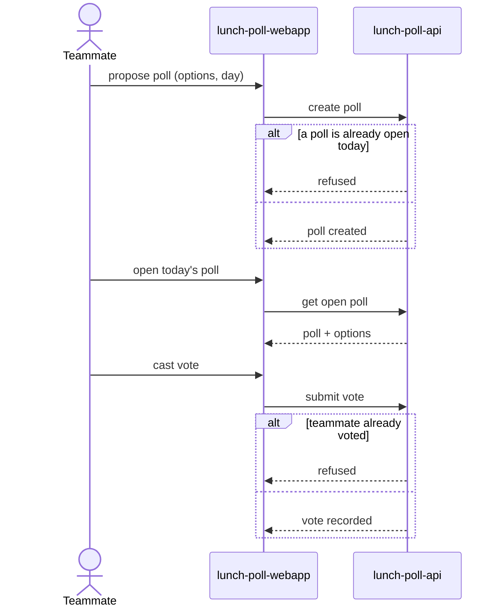

# Propose a poll, then vote

A teammate starts today's lunch poll, and another teammate casts their vote.

```mermaid
sequenceDiagram
    actor Teammate
    participant webapp as lunch-poll-webapp
    participant api as lunch-poll-api

    Teammate->>webapp: propose poll (options, day)
    webapp->>api: create poll
    alt a poll is already open today
        api-->>webapp: refused
    else
        api-->>webapp: poll created
    end

    Teammate->>webapp: open today's poll
    webapp->>api: get open poll
    api-->>webapp: poll + options
    Teammate->>webapp: cast vote
    webapp->>api: submit vote
    alt teammate already voted
        api-->>webapp: refused
    else
        api-->>webapp: vote recorded
    end
```